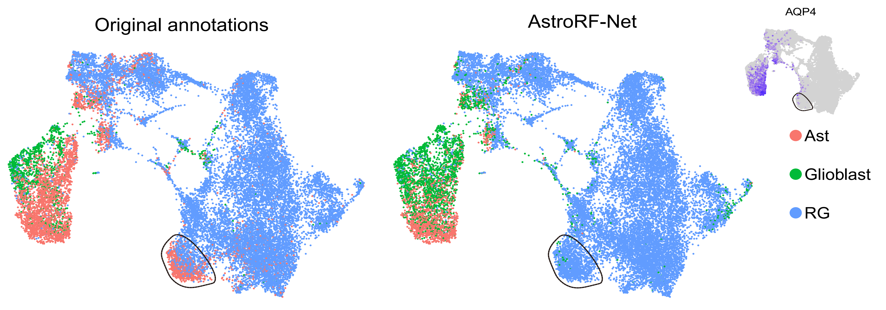

# AstroRF-Net

AstroRF-Net is a neural network classifier that predicts **Astrocyte / Glioblast / Radial-Glial** labels from an input **AnnData** object.  
Pipeline: **input_adata → log2(CPM+1) normalization → select top-50 RF markers → NN inference → write predictions to `adata.obs["AstroRF-Net"]`.**

## Install
```bash
pip install -i https://test.pypi.org/simple/ astrorfnet
```

## Preparation
A prerequisite for the analysis is an AnnData object containing a cell-by-gene expression matrix. This dataset must be pre-filtered to include only putative astrocytic lineage cells. The raw count matrix from this curated cell population is designated as the input for the tool. **The model parameters and gene importance list can be downloaded from the link below.**
- **[Example_adata](https://github.com/meiran5759-blip/AstroRF-Net/releases/latest/download/example_adata.h5ad)**
- **[AstroRF-Net parameters](https://github.com/meiran5759-blip/AstroRF-Net/releases/latest/download/net.params)**
- **[Gene importance](https://github.com/meiran5759-blip/AstroRF-Net/releases/latest/download/Gene_importance_3Celltype_233gene_mean.xlsx)**


## Usage
```python
import scanpy as sc
import torch
import astrorfnet
from astrorfnet import run_astro_rf_net
example_adata = sc.read_h5ad('/path/to/example_adata.h5ad')
example_adata_out, info = run_astro_rf_net(
    input_anndata=example_adata,
    model_param_path="/path/to/net.params",
    marker_gene_xlsx="/path/to/Gene_importance_3Celltype_233gene_mean.xlsx",
    n_markers=50,
    out_obs_col="AstroRF-Net"
)
```

## ​​Improve annotation accuracy​​
For the astrocytic lineage, AstroRF-Net demonstrated higher accuracy in cell type prediction compared to manual annotation, particularly in effectively distinguishing between radial glial cells and astrocytic cells. The cluster of cells highlighted in the black box within the image shows minimal expression of AQP4, a canonical marker gene for astrocytes, yet was inaccurately annotated as astrocytes by manual labeling.



